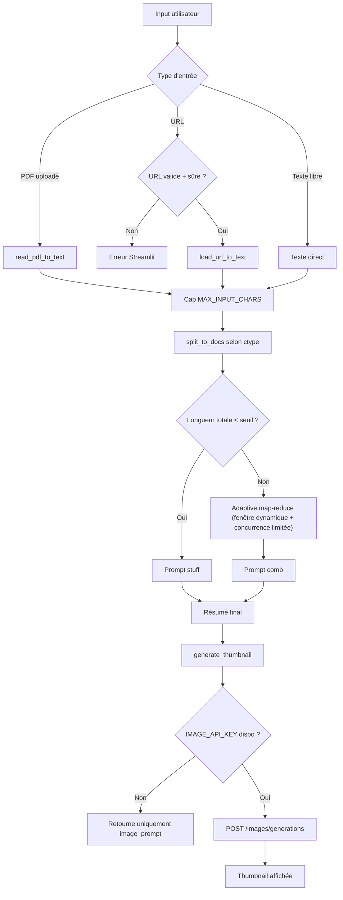
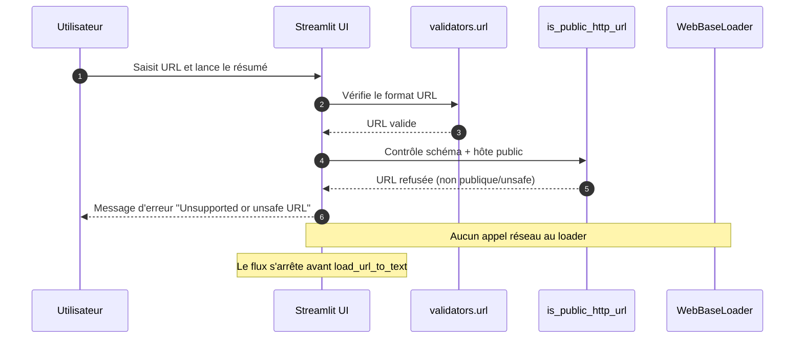

# Summarizer + Thumbnail

A Streamlit app that summarizes long-form content (URL, pasted text, or PDF) using LangChain + OpenAI-compatible chat models, then optionally generates an illustrative thumbnail image.

## Features

- Summarize content from:
  - direct text input,
  - public HTTP/HTTPS URLs,
  - uploaded PDF files.
- Language-aware summaries (`English`, `Français`, `Español`, `Deutsch`).
- Content type modes (`Scientific Paper`, `General Text`, `News Article`, `Technical Documentation`).
- Adaptive map-reduce summarization for long inputs.
- Optional image generation from the final summary.
- Basic SSRF protections for URL inputs.

## Requirements

- Python 3.9+
- pip
- OpenAI-compatible API key for text generation
- (Optional) image generation API key/model endpoint

## Installation

```bash
git clone https://github.com/ynotopec/summarize
cd summarize
python -m venv .venv
source .venv/bin/activate  # Windows: .venv\Scripts\activate
pip install streamlit langchain langchain-openai langchain-community langchain-text-splitters \
  python-dotenv openai bs4 pdfplumber validators pillow requests tiktoken
```

## Configuration

Create a `.env` file in the project root:

```env
# Text summarization model
OPENAI_API_KEY=your_key_here
OPENAI_API_MODEL=ai-summary
OPENAI_BASE_URL=https://api.openai.com/v1

# Optional image generation
IMAGE_API_KEY=your_image_key_here
IMAGE_MODEL=gpt-image-1
IMAGE_BASE_URL=https://api.openai.com/v1
IMAGE_SIZE=1024x1024

# Optional app tuning
MAX_INPUT_CHARS=300000
ASYNC_CONCURRENCY=8
REQUEST_TIMEOUT=30
```

## Run

```bash
streamlit run app.py
```

Open the local URL shown by Streamlit (usually `http://localhost:8501`).

## Usage Notes

- If you provide a URL, it must be a public `http` or `https` URL.
- For long documents, the app automatically chunks text and performs a map-reduce style summary.
- If image generation is not configured, summarization still works.

## (A) Router / Decision Flow



## (B) Séquence — cas critique (URL non sûre / SSRF)

Cas critique couvert : l'utilisateur soumet une URL interne (`localhost`, IP privée, `.local`, etc.) afin d'éviter les accès SSRF.



## Troubleshooting

- **No summary returned**: verify `OPENAI_API_KEY`, model name, and base URL.
- **Image not generated**: verify `IMAGE_API_KEY`, image model, and image base URL.
- **Dependency errors**: ensure your virtual environment is active and reinstall required packages.
